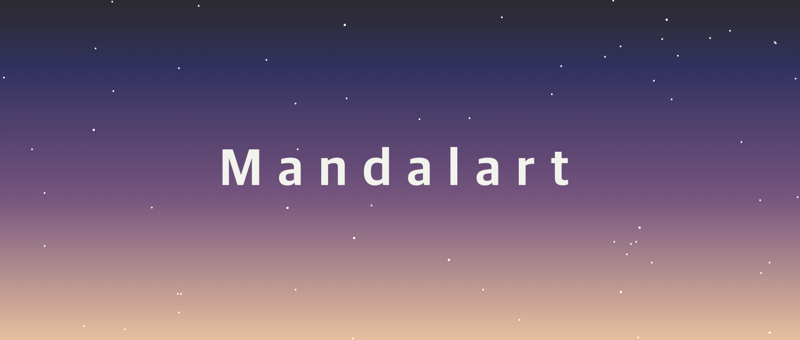
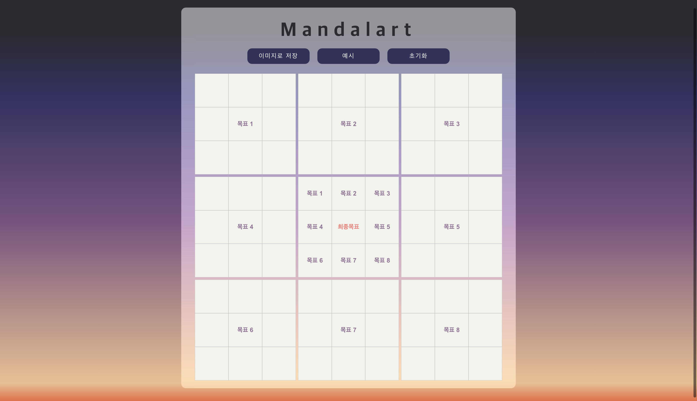
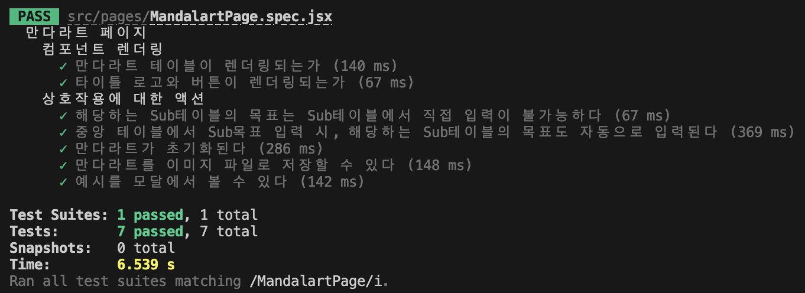

<div align='center'>

  
  <br /><br />
 
 <a href=''>
  
  
  
 </a>
  <h2> 🎨 Draw your future with Mandalart 🖼️ ✨ </h2>
  <br /><br />
</div>

## Preview


<br />

## Features

- Make Mandalart
- Export Mandalart to Image
- Reset (Initialize) Mandalart 

<br />

## Built With

- [`React`](https://reactjs.org/)
- [`recoil`](https://jestjs.io/)
- [`styled-components`](https://styled-components.com/)
- [`MUI`](https://mui.com/)
- [`jest`](https://jestjs.io/)
- [`react-testing-library`](https://testing-library.com/)

<br />

## 100% Tested


<br />

## TODO

- remove `recoil` 
- add 'darkening untyped sub-goal table' feature 

<br />

## How to Start 
Use `yarn`
```
yarn 

yarn start
```
Use `npm`
```
npm install

npm start
```

<br />

## License

- [`MIT License`]('./LICENSE')