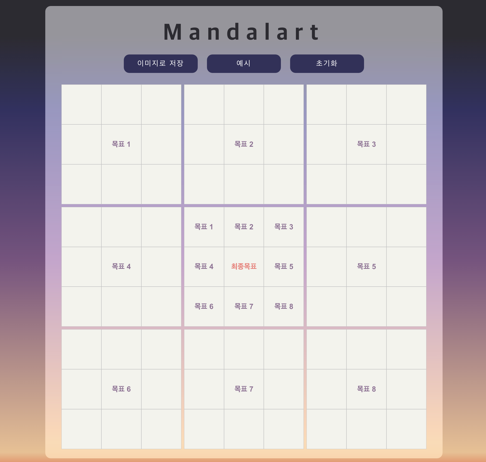

<div align='center'>

  
  <br /><br />
 
 <a href=''>
  
  
  
 </a>
  <h2> 🎨 Draw your future with Mandalart 🖼️ ✨ </h2>
  <br /><br />
</div>

## Preview


<br />

## Features

- Make Mandalart
- Export Mandalart to Image
- Reset (Initialize) Mandalart 

<br />

## Built With

- [`React`](https://reactjs.org/)
- [`recoil`](https://jestjs.io/)
- [`styled-components`](https://styled-components.com/)
- [`MUI`](https://mui.com/)
- [`jest`](https://jestjs.io/)
- [`react-testing-library`](https://testing-library.com/)

<br />

## 100% Tested


<br />

## TODO

- `recoil` 적용된 부분 제거 (서비스 방향이 달라지면서 필요 없어짐)
- 서브목표 테이블 어둡게 -> 메인목표 테이블에서 서브목표 작성 시 해당 서브목표의 테이블 밝아지게 수정 
(초기에 서브목표 테이블은 작성 불가능한데 동일한 밝기로 되어있으니 혼란스러울 수 있으므로)
- 예시 버튼 클릭 시 뜨는 모달 창에서 여러 예시를 보여줄 수 있도록 carousel 적용 
- 모바일 화면에서 배경 하단이 이상하게 뜨는 부분 수정 

<br />

## How to Start 
Use `yarn`
```
yarn 

yarn start
```
Use `npm`
```
npm install

npm start
```

<br />

## License

- [`MIT License`]('./LICENSE')